# TianGong Agent

Contents

- [Env Preparing](#env-preparing)
  - [🐳VSCode Dev Contariners](#vscode-dev-contariners)
  - [Local Env](#local-env)
- [Key Configurations](#key-configurations)
  - [OpenAI API key](#openai-api-key)
  - [Pinecone](#pinecone)
  - [Xata](#xata)
  - [LLM model](#llm-model)
  - [Password (optional)](#password-optional)
- [Customorize your own UI](#customorize-your-own-ui)
- [Start locally](#start-locally)
  - [Auto Build](#auto-build)
  - [Production Run](#production-run)
- [Deployment](#deployment)

## Env Preparing

### VSCode Dev Contariners

[Tutorial](https://code.visualstudio.com/docs/devcontainers/tutorial)

Python 3 -> Additional Opentions -> 3.11-bullseye -> ZSH Plugins (Last One) -> Trust @devcontainers-contrib -> Keep Defaults

### Local Env

Install `Python 3.11`

```bash
sudo apt update
sudo apt install software-properties-common
sudo add-apt-repository ppa:deadsnakes/ppa
sudo apt install python3.11
```

Setup `venv`:

```bash
python3.11 -m venv .venv
source .venv/bin/activate
```

Install requirements:

```bash
pip install --upgrade pip
pip install -r requirements.txt -i https://pypi.tuna.tsinghua.edu.cn/simple
pip install -r requirements.txt --upgrade
```

```bash
sudo apt-get update
sudo apt-get upgrade -y
sudo apt-get install -y libmagic-dev poppler-utils tesseract-ocr libreoffice pandoc
```

Install Cuda (optional):

```bash
sudo apt install nvidia-cuda-toolkit
```

## Key Configurations

Replace `Your*` in the file `.streamlit/secrets.dev.toml` with **your own keys**.

```bash
openai_api_key = "YourKey"
pinecone_api_key = "YourKey"
pinecone_environment = "YourENV"
pinecone_index = "YourIndex"
xata_api_key = "YourKey"
xata_db_url = "YourURL"
langchain_verbose = true
llm_model = "YourModel"
password = "YourKey"
```

### OpenAI API key

Follow these steps to retrieve your OpenAI API key :

#### 1. Register or Log in to Your Account

If you don't already have an account with OpenAI, you'll need to [register](https://platform.openai.com/signup) for one.

Go to the [Overview - OpenAI API](https://platform.openai.com/). Enter your credentials to log in to your OpenAI account.

#### 2. Access API Keys

Step1: Once logged in, click on your account name in the upper right corner. In the dropdown menu, select "View API keys."

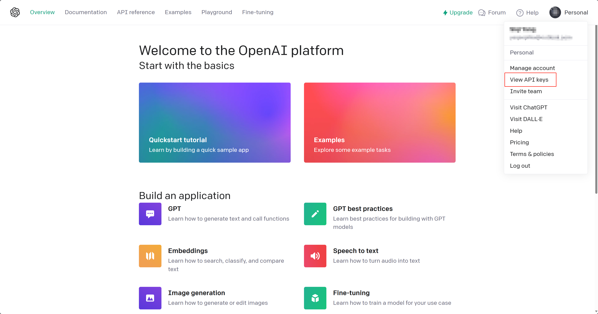

Step2: Create a New API key

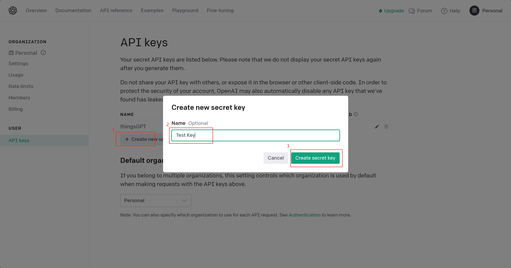

Step3: Copy the API key

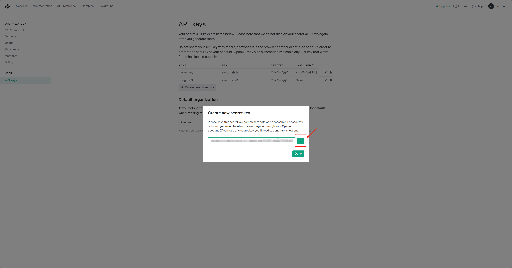

Step4: Paste it into your code as follows:

```bash
openai_api_key = "YourKey"
```

### Pinecone

Follow these steps to retrieve your Pinecone API Key and Environment:

#### 1. Register or Log in to Your Account

If you don't already have an account with Pinecone, you'll need to [register](https://app.pinecone.io/?sessionType=signup) for one.

Go to the [Vector Database for Vector Search | Pinecone](https://www.pinecone.io/). Enter your credentials to log in to your Pinecone account.

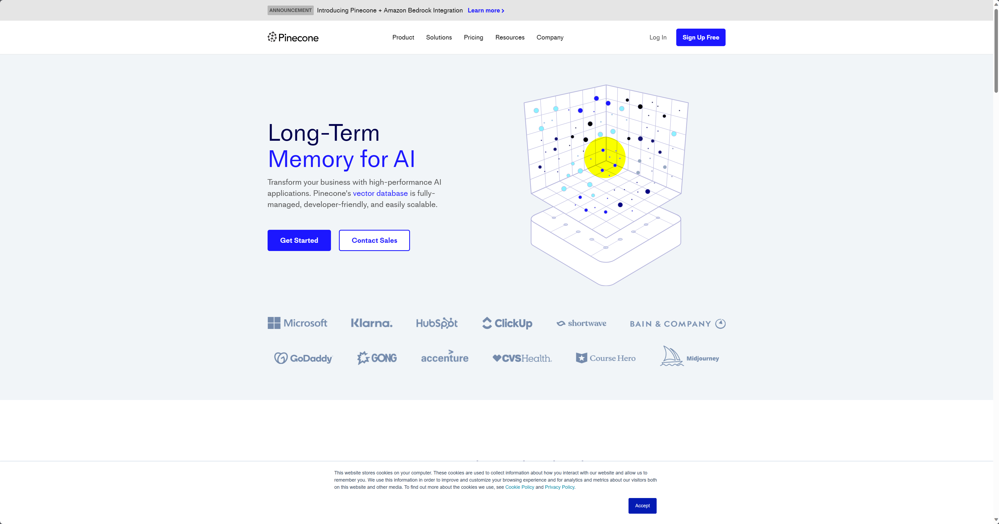

#### 2. Access API Key and Environment

Step1: Once logged in, select "API Keys" in the left corner. Then create a new API key by step1-3. You can also use the default API.

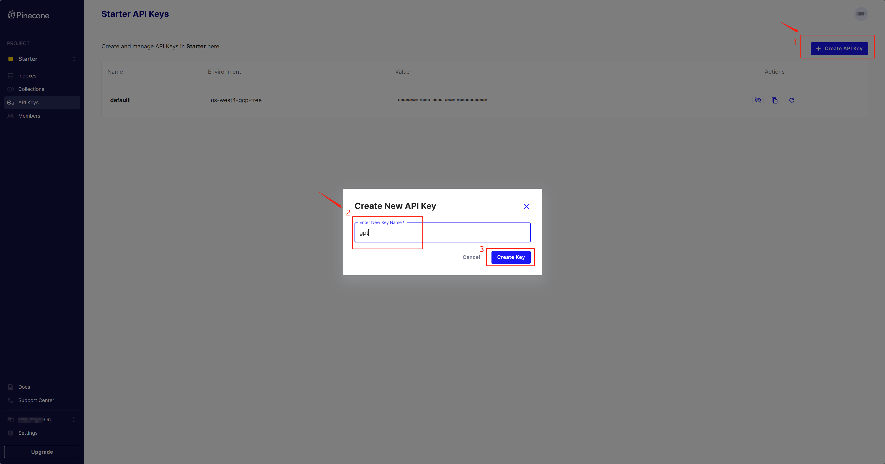

Step2: Copy the API key (Value) and Environment

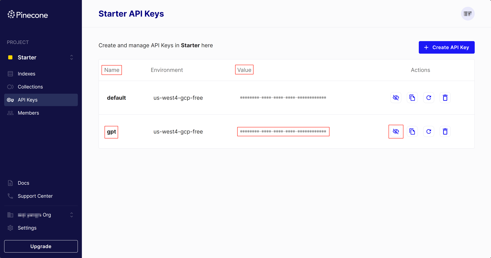

Step3: Paste it into your code as follows:

```bash
pinecone_api_key = "YourKey"
pinecone_environment = "YourENV"
```

#### 3. Pinecone Index

Step1: Create a New Index

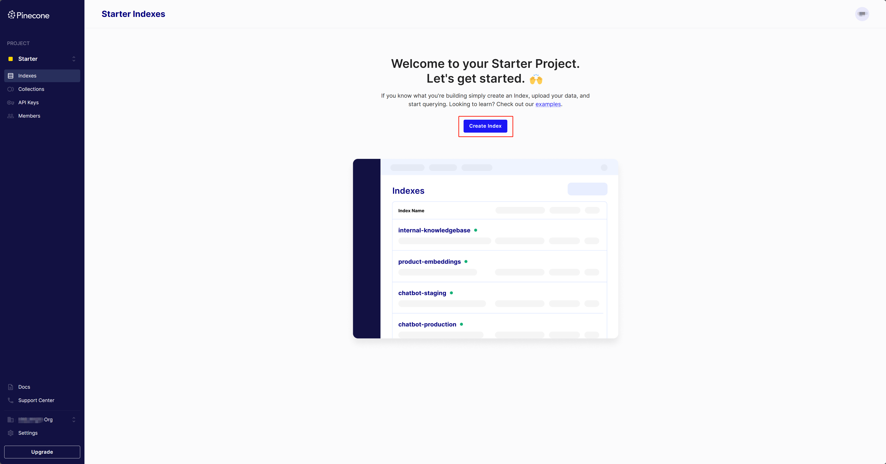

Step2: Index Configuration
  
  **- Custom index name.** Example: gpt.
  
  **- Select the index type and size.** Dimensions: 1536. Metric cosine: cosine. Select your Pod Type: Default starter.

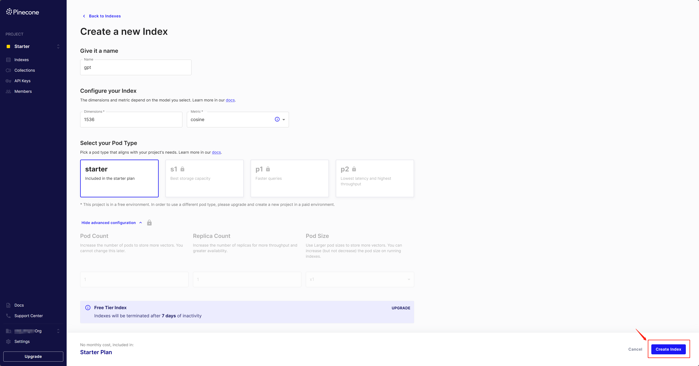

Step3: Paste *Index Name* into your code as follows:

  ```bash
  pinecone_index = "YourIndex"
  ```

### Xata

Follow these steps to retrieve your Xata API Key and Database URL:

#### 1.Register or Log in to Your Account

You can use your GitHub or Google account to log in to [Xata](https://xata.io/).  

#### 2. Access API Key

Step1: Once logged in, click on your account name in the upper right corner. In the dropdown menu, select "Account settings."

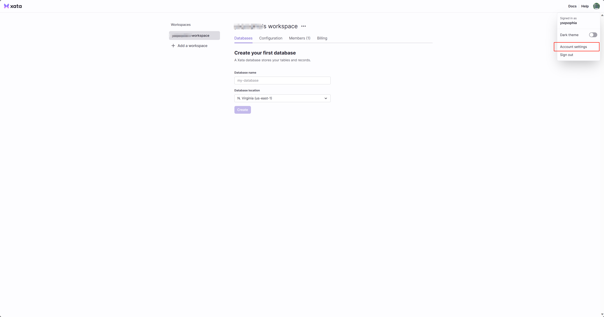

Step2: Add a new API key.

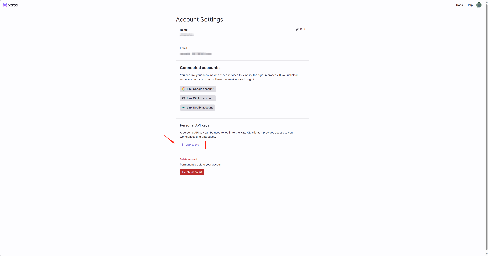

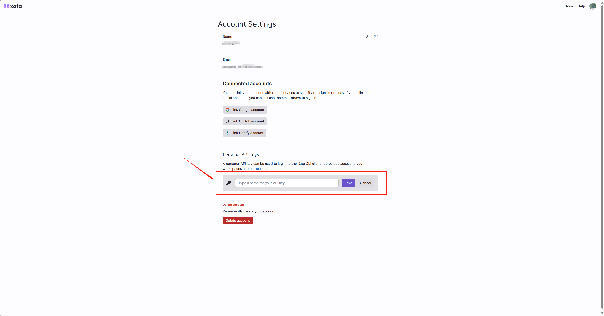

Step3: Copy the API key

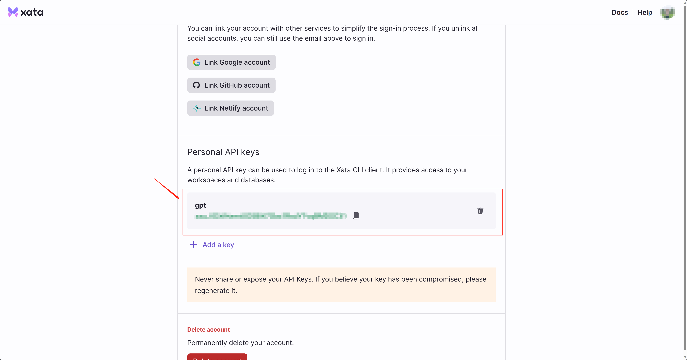

Step4: Paste it into your code as follows:

```bash
xata_api_key = "YourKey"
```

#### 3. Access Database URL

Setp1: Creat a new database.


Step2: Clink the gear icon and go to the Copy Database URL

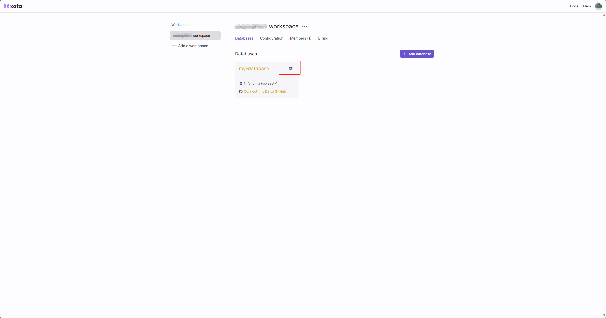

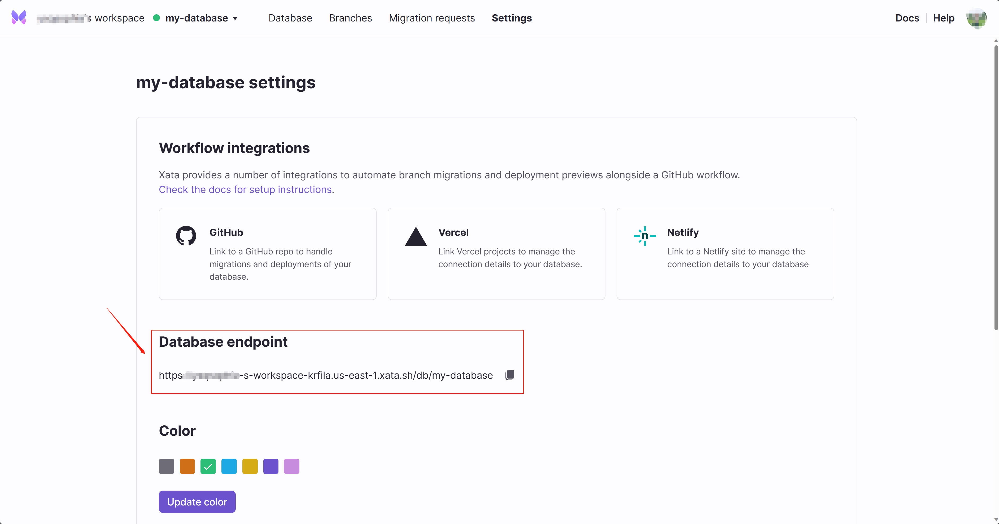

Step3: Paste it into your code as follows:

```bash
xata_db_url = "YourURL"
```

### LLM model

### Password (optional)

## Customorize your own UI

./src/ui/tiangong-en.py

## Start locally

```bash
export ui=tiangong-en
streamlit run AI.py
```

Or Using VsCode Debug Streamlit Config

### Auto Build

The auto build will be triggered by pushing any tag named like release-v$version. For instance, push a tag named as release-v0.0.1 will build a docker image of 0.0.1 version.

```bash
#list existing tags
git tag
#creat a new tag
git tag release-v0.0.1
#push this tag to origin
git push origin release-v0.0.1
```

### Production Run

```bash
docker run --detach \
    --name tiangong-agent \
    --restart=always \
    --expose 8501 \
    --net=tiangongbridge \
    --env ui=tiangong-en \
    --env VIRTUAL_HOST=YourURL \
    --env VIRTUAL_PORT=8501 \
    --env LETSENCRYPT_HOST=YourURL \
    --env LETSENCRYPT_EMAIL=YourEmail \
    image:tag
```

## Deployment

For deploying a prototype of this project, we recommend using Streamlit. Streamlit provides an intuitive way to turn data scripts into shareable web applications. If you're unfamiliar with Streamlit or need guidance on deploying your app, refer to their official documentation:
[Steamlit APP Deploy](https://docs.streamlit.io/streamlit-community-cloud/deploy-your-app)
